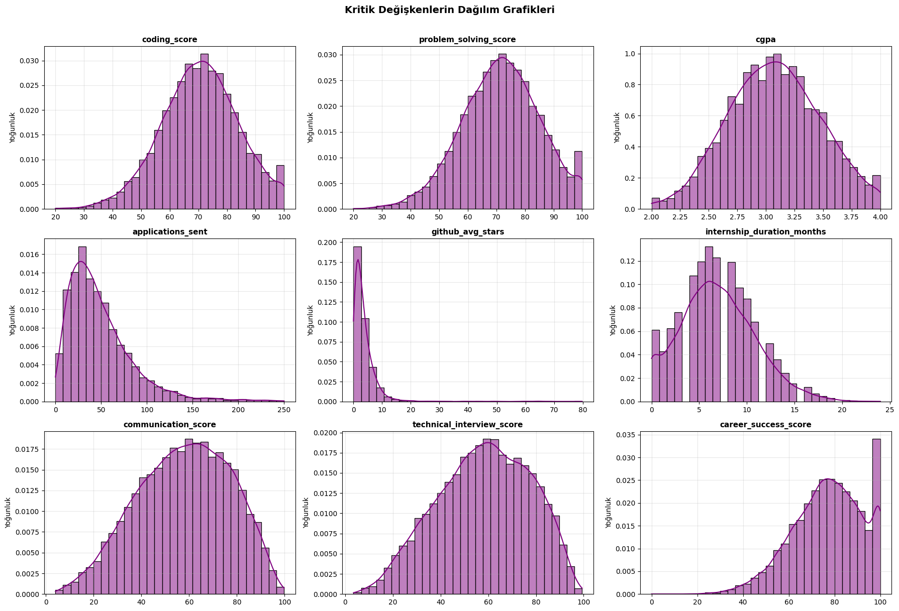
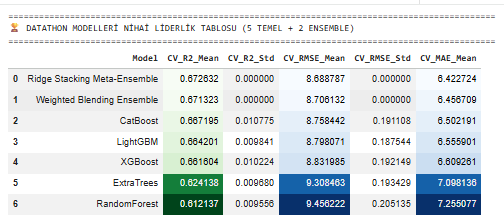

# Datathon-2026-Kariyer-Başarı-Tahminleme-Modeli

## 🎯 Problem
Kariyer verilerindeki yüksek değişkenlik, eksik değerler ve
metinsel geri bildirimlerin karmaşıklığı nedeniyle başarı
tahminlemesinde yüksek varyans ve overfitting riski.

##  Yaklaşım
Sızıntısız bir veri hattı (MICE Imputation) kuruldu. NLP
süreçlerinde Sentence-BERT ve SVD ile boyut indirgeme
kullanıldı. Model kararlılığı için 15 katmanlı "RepeatedKFold"
çapraz doğrulama ve "Optuna" tabanlı hiperparametre
optimizasyonu gerçekleştirildi. Nihai tahminler için Ridge
Stacking ve TTA (Test-Time Augmentation) içeren hibrit bir
ensemble yapısı kuruldu.

## 🛠 Kullanılan Teknolojiler
Python, Scikit-learn, XGBoost, LightGBM, CatBoost, Optuna,
Sentence-BERT, TruncatedSVD, Pandas, NumPy

## 📊 Önemli Bulgular
Diferansiyel blending ve dağılım hizalama (distribution
alignment) teknikleriyle, test seti üzerindeki varyans minimuma
indirilerek modelin genelleme başarısı artırıldı; yüksek boyutlu
metin ve yapısal veriler başarıyla entegre edildi.

## 🚀 Nasıl Çalıştırılır?
İlgili `.ipynb` dosyasını Jupyter Notebook veya Google Colab üzerinden açarak kodları inceleyebilirsiniz.

### 1. Sayısal Değişkenlerin Dağılım Analizi

  

### 2. Eksik Değer Analizi

  

### 3. Aykırı Değer Analizi

  

### 4. Hedef Değişken (Target) Detaylı Dağılım Analizi

  

### 5. Kategorik Sütunlar ve Hedef Etki Analizi

  

### 6. Güvenli Kategorik Encoding Operasyonu

  

### 7. Küresel Sinyal Analizi ve Geçici Koruma

  

### 8. Sentence-BERT Modeli ve Embedding Hazırlığı

  

### 9. Veri Kalite Kontrolü ve Bütünlük Denetimi

  

### 10. Temel Modellerin Optimize Edilmiş Otomatik Eğitimi

  

### 11. Liderlik Tablosu ve Karşılaştırma Paneli

  
